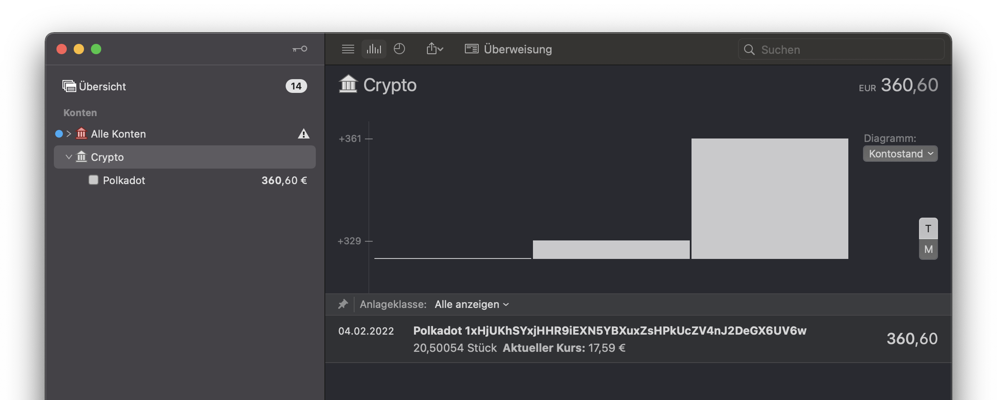

# Polkadot Network Extension for MoneyMoney

Fetches Polkadot address balances from the Blockchair API (free tier) and displays them as securites in MoneyMoney.

## Installation

### Download Extension

You can get a signed version of this extension from

* my [GitHub Releases page](https://github.com/trummerfeld/polkadot-moneymoney-extension/releases), or
* the [MoneyMoney Extensions page](https://moneymoney-app.com/extensions/)

Once downloaded, move `dot.lua` to your MoneyMoney Extensions folder.

### Account Setup in MoneyMoney

* Add a new account of type “Polkadot”
* Enter one or more DOT addresses with comma separation (e.g. `1xHjUKhSYxjHHR9iEXN5YBXuxZsHPkUcZV4nJ2DeGX6UV6w`)
* Enter anything as the password (the dialog wants to have a password..)
**Note:** You can can enter anything for password, e.g. `test`

## Limitations

* EUR is the base currency for this Extension
* This Extension works with MoneyMoney >=2.4.9 (from Beta onwards)